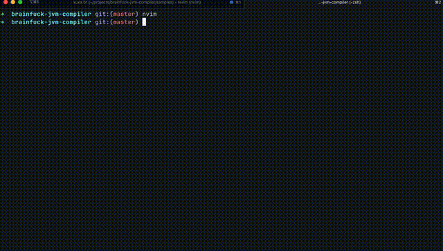

# BrainJuck: The Ultra Master Brainfuck JVM Compiler

A Brainfuck-to-JVM bytecode compiler written in JavaScript (Node.js). This project enables you to compile Brainfuck source code into JVM bytecode, allowing Brainfuck programs to run on the Java Virtual Machine (JVM).

## Features

- Compiles Brainfuck source code to executable JVM `.class` files
- Supports all standard [Brainfuck commands](https://github.com/sunjay/brainfuck/blob/master/brainfuck.md) (`+`, `-`, `>`, `<`, `[`, `]`, `.`, `,`)
- Command-line interface for compiling and running Brainfuck programs
- Cross-platform: runs anywhere the JVM is available

## Getting Started

### Prerequisites

- Java 8 or higher installed
- Node.js v22 or higher installed

Clone the repository:

```sh
git clone https://github.com/geeksilva97/brainjuck.git
cd brainjuck
```

Demo, video below:




### Usage

#### Compile a Brainfuck Program

```sh
./brainjuck your-brainfuck-file.bf [<output-class-name>]
```

- `your-brainfuck-file.bf`: The Brainfuck source file you want to compile.
- `<output-class-name>`: Optional. The name of the output class file (default is `CompiledBrainfuck`).


#### Run the Generated Class

```sh
java OutputClassName
```

## Examples

Compile and run the classic "Hello, World!":

```sh
./brainjuck samples/helloworld.bf HelloWorld
java HelloWorld
```

## Implementation Details

The compiler generates proper JVM bytecode with valid StackMapTable attributes, ensuring compatibility with modern JVM bytecode verification requirements. The generated classes can run on any standard JVM without special flags.

---

Made with ❤️ by [geeksilva97](https://github.com/geeksilva97)
